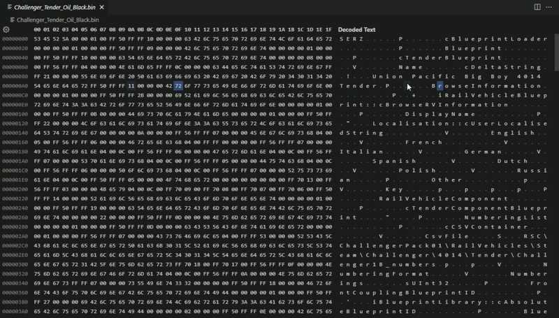

# RailWorks Serz integration for Visual Studio Code

This is an extension that integrates the serz.exe utility from the game Train Simulator Classic (also known as RailWorks) into Visual Studio Code, to convert the game `.bin` files to `.xml` and vice versa directly from within the editor.  

This extension is intended as a replacement for the .bin editing capabilities of the now-defunct TS-Tools program, while also being much faster and more user freindly thanks to Visual Studio Code's superior code editing and Search and Replace features.  



## Installation

This extension requires [Visual Studio Code 1.72.0+](https://code.visualstudio.com/) to function.  
Like any other extension, you can install it through the integrated [Extensions tab](https://code.visualstudio.com/docs/editor/extension-marketplace) in Visual Studio Code by searching for "Railworks Serz integration". Alternatively, you can also download and install it manually from the [Releases page](https://github.com/ElPerenza/VSCode-serz/releases).  

After having installed it, you need to change a couple of settings in the editor for it to work properly:
- **Serz Exe Path**: The path to the serz executable to use for conversion. The path can either point directly at the serz.exe file or at the directory it's found in.
- **Default Binary Editor**: The default editor with which to open binary files. Whilst not necessary for the extension to work, setting this to `default` will save you the hassle of having to specify each time how to open a binary file (like the .bin files used by RailWorks) in the editor.  

And that's it! You can now seamlessly convert between `.bin` and `.xml` files without ever leaving the editor.

## Usage

This extension exposes two commands to convert RailWorks files:
- **Convert a file with serz** (`vscode-serz.convert`) lets you convert a .xml file to .bin and vice versa. You need to specify which file to convert yourself via the pop-up dialog. Can be invoked either via the Command Palette (open with `CTRL+SHIFT+P`) or via the keyboard shortcut `SHIFT+ALT+Q`.
- **Convert current file with serz** (`vscode-serz.convertCurrent`) converts the currently focused file. This command requires no user input and can be invoked via che Command Palette, the keyboard shortcut `ALT+Q` or by right clicking on the file you want to convert and selecting "Convert current file with serz" from the opened menu.  
Because of restrictions imposed by the editor, this command won't work with files that are larger than 50MB. If you need to convert large files, use the `convert` command instead.

## Feedback, Bugs and Contributing

Do you have a question, an idea on how to make this extension better or have you found a bug? [Open an issue](https://github.com/ElPerenza/VSCode-serz/issues) where we can discuss!

If you want to help with the development of this extension, here is some more technical information on the project:

### Environment setup

To develop this extension, you need VSCode 1.72.0+. Before you can start developing, create a `config.ts` file in `src/test/suite` and put this inside it:
```ts
export default {
    folder: "/path/to/test-assets" //this MUST be absolute
}
```
This file is used by the test code to determine where the `test-assets/` directory can be found.

### Running and Debugging

The default `Run Extension` and `Extension Tests` launch configurations are used for this extension. You can execute them from the "Run" tab in the Activity Bar.

### VSCode contributes

This extension contributes 2 commands (`vscode-serz.convert` and `vscode-serz.convertCurrent`) and 1 configuration setting (`vscode-serz.serzExePath`). For a description of their purpose check out the "Installation" and "Usage" sections of this readme.

### Structure

- `.vscode/`: contains the VSCode launch configurations, tasks and settings
- `assets/`: contains the extension logo and the demo gif used in this readme.
- `src/extension.ts`: contains the extension code.
- `src/test/suite/extension.test.ts`: contains the extension tests, written with Mocha.
- `test-assets/`: contains the .bin and .xml files used for testing.
- `package.json`: contains the extension properties and contributes definitions